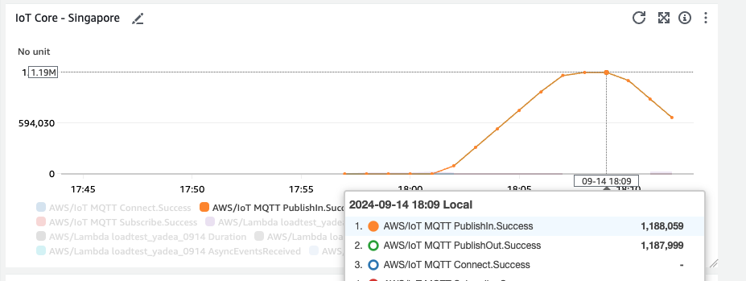

# Serverless Load Test of Amazon IoT Core
## Overview
Many customers have built their IoT platform based on AWS managed service “IoT Core”. Normally, the IoT system consists of many cloud services, such as IoT Core, Kafka, DynamoDB, S3, SNS, etc. 

The entire IoT data pipeline involves various cloud services. In actual production systems, each node may encounter failures, leading to an overall system outage. Additionally, the environment in which the devices operate often has a great deal of uncertainty. Before officially going live, the system generally requires detailed and thorough testing to ensure that, even if there is a sudden surge in load traffic, the system can still operate according to the predefined logic, and the system's robustness and resilience can handle these unexpected events.
Therefore, stress testing is an indispensable step in the evolutionary process of the Internet of Things (IoT) platform. Currently, in the IoT field, the device connection layer service generally adopts the MQTT protocol, and the simulation of MQTT messages is a crucial step in stress testing.

## Solution Introduction
A typical IoT platform diagram is shown below:

We can generally divide the IoT data flow into uplink and downlink. Uplink data usually includes periodic reports of sensor status data, device operational data, etc. Downlink data typically involves control commands, broadcast pushes, etc. The frequency of sending downlink messages is generally not high. In most scenarios, the traffic bottleneck exists in the uplink data, particularly when the number of devices reaches millions or tens of millions. The aggregated message reporting requests can result in peak TPS (Transactions Per Second) exceeding tens of thousands.

## Get Started
IoT Core supports different protocols for message publish & subscribe: MQTT, HTTP, MQTT over WebSocket.
### HTTP Solution

### MQTT Solution

## Metrics
IoT Core has default TPS limits of PublishIn (uplink) and PublishOut (downlink) requests for most regions:
* PublishIn TPS limit = 20,000/s
* PublishOut TPS limit = 20,000/s
### CloudWatch Request TPS Result

### InfluxDB Latency Result

# Security

See [CONTRIBUTING](CONTRIBUTING.md#security-issue-notifications) for more information.

# License

This library is licensed under the MIT-0 License. See the LICENSE file.

